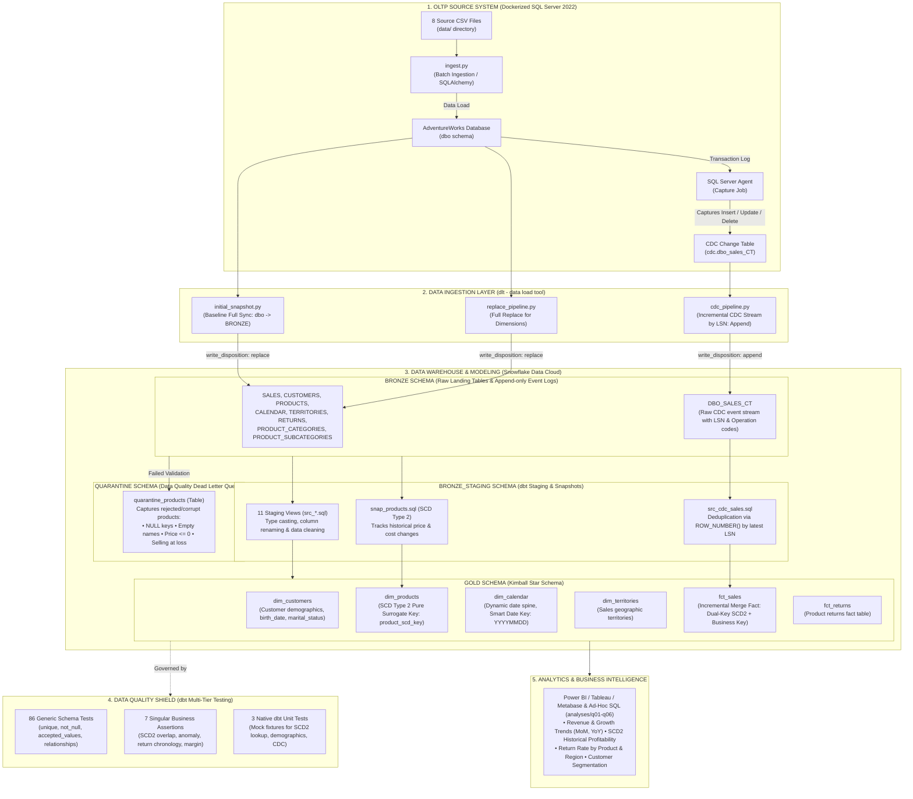
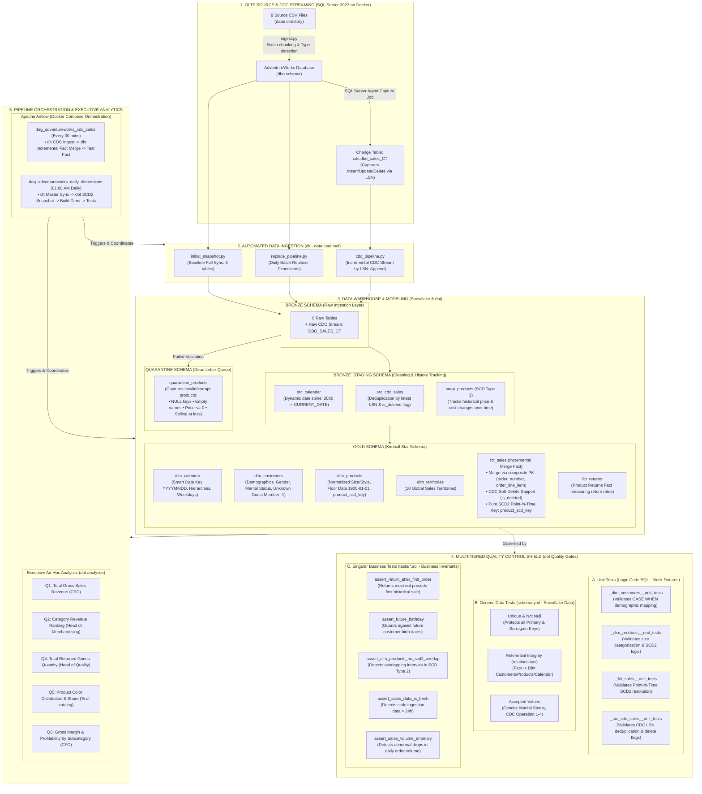
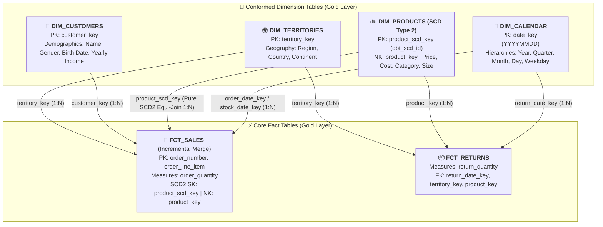
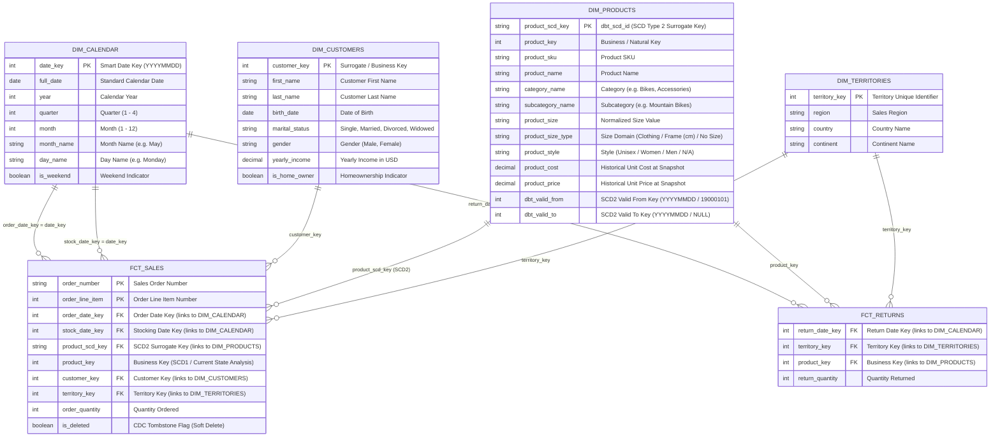

# AdventureWorks End-to-End Modern Data Platform
> **Enterprise Data Platform:** Simulated OLTP on SQL Server &rarr; CDC Streaming & Batch Ingestion with DLT &rarr; Snowflake Data Cloud &rarr; Data Transformation & Modeling with dbt Core (Star Schema / Medallion Architecture).

---

## 1. End-to-End Architecture Overview



### 1.2. Functional Architecture & Quality Gates Map

> **Operational & Verification Blueprint:** Comprehensive functional decomposition mapping the lifecycle of data flows, automated transformation capabilities, multi-layered quality control gates (Native Unit Tests, Generic Schema Validations, Singular Business Invariant Assertions), Airflow DAG orchestration, and downstream executive business intelligence.



#### Functional Capability & Verification Matrix

| Functional Pillar | Core Capabilities & Business Responsibilities | Active Verification & Quality Control Gates |
| :--- | :--- | :--- |
| **1. OLTP Simulation & CDC** | • Dockerized SQL Server 2022 hosting enterprise `AdventureWorks` database.<br/>• Automated ingestion of 8 CSV datasets with type detection and batch chunking (`chunksize=1000`).<br/>• SQL Server Agent capture job tracking row mutations (`INSERT`, `UPDATE`, `DELETE`) on `dbo.sales` via LSNs. | • Active healthcheck polling port `1433`.<br/>• Verification of CDC database enablement (`sys.sp_cdc_enable_db`).<br/>• Strict composite primary key enforcement `(order_number, order_line_item)`. |
| **2. Automated Ingestion (dlt)** | • **Baseline Full Sync:** Ingests initial 8 tables into Snowflake `BRONZE`.<br/>• **Periodic Master Replace:** Refreshes 7 dimension tables with `write_disposition="replace"`.<br/>• **Incremental CDC Streaming:** Continuously extracts new LSNs from `cdc.dbo_sales_CT` with `write_disposition="append"`. | • RSA Key-Pair authentication healthchecks with Snowflake.<br/>• LSN checkpoint persistence to guarantee zero data loss.<br/>• Schema evolution and precision hints on raw JSON extraction. |
| **3. Staging & SCD2 Tracking** | • 11 Staging views (`src_*.sql`) performing column casting, renaming, and cleaning.<br/>• CDC deduplication isolating the latest transaction state via `ROW_NUMBER() OVER (...)`.<br/>• dbt snapshot (`snap_products`) tracking historical price and cost mutations (SCD Type 2).<br/>• Dynamic calendar generation from `2000-01-01` to `CURRENT_DATE()` via Snowflake `GENERATOR`. | • **Unit Test:** `_src_cdc_sales__unit_tests.yml` validates LSN ordering and delete flag generation.<br/>• **Singular Test:** `assert_dim_products_no_scd2_overlap.sql` guarantees zero overlapping validity windows. |
| **4. Quarantine Dead Letter Queue** | • Automated trap routing corrupt or dirty product records into `QUARANTINE.QUARANTINE_PRODUCTS`.<br/>• Tags each record with explicit audit reasons (`Missing Key`, `Negative Price`, `Cost > Price`).<br/>• Isolates upstream errors without halting production pipeline execution. | • Ensures downstream Gold Dimensions and Facts consume 100% verified, clean master records.<br/>• Supports operational alerting for inventory and catalog teams. |
| **5. Gold Star Schema (Kimball)** | • **4 Conformed Dimensions:** `dim_calendar` (Smart Date Keys), `dim_customers` (demographics), `dim_products` (pure SCD2 surrogate keys), `dim_territories`.<br/>• **2 Core Facts:** `fct_sales` (Incremental Merge with soft-deletes) and `fct_returns`.<br/>• **Floor Date Normalization (`1900-01-01`):** Resolves historical sales matching across SCD2 boundaries.<br/>• **Unknown Dimension Support (`-1`):** Protects 100% of revenue from guest checkout transactions. | • **Generic Tests:** 86 automated `unique`, `not_null`, and `accepted_values` checks.<br/>• **Referential Integrity:** `relationships` tests strictly enforce all foreign keys point to valid dimension keys.<br/>• **Unit Test:** `_fct_sales__unit_tests.yml` verifies point-in-time surrogate key lookup logic. |
| **6. Data Observability & Anomaly Guard** | • Protects against silent data pipeline failures and stale ingestion streams.<br/>• Compares transactional arrival times against operational SLAs.<br/>• Rolling 7-day statistical anomaly detection on daily sales volumes. | • **Singular Test:** `assert_sales_data_is_fresh.sql` flags errors when data is older than 24 hours.<br/>• **Singular Test:** `assert_sales_volume_anomaly.sql` triggers alerts if order volume drops below 30% of normal.<br/>• **Singular Test:** `assert_return_after_first_order.sql` enforces chronological validity. |
| **7. Airflow Orchestration & Alerting** | • Full Docker Compose environment (Webserver, Scheduler, Triggerer, PostgreSQL).<br/>• **`dag_adventureworks_cdc_sales`:** High-frequency 30-minute incremental CDC sync & fact merge.<br/>• **`dag_adventureworks_daily_dimensions`:** Daily 01:00 AM batch sync for master dimensions and SCD2 snapshots. | • Isolated Python virtual environment (`Dockerfile.airflow`).<br/>• Automatic retry on network hiccups (`retries=2, retry_delay=3m`).<br/>• Readiness for Slack/Telegram webhook failure alerting. |
| **8. Executive Business Analytics** | • Production-ready ad-hoc analytical queries (`analyses/q01.sql` through `q06.sql`).<br/>• Answers strategic questions for Chief Financial Officer (CFO), Head of Merchandising, and Quality Assurance. | • Resolves SCD2 Point-in-Time joins without inflating revenue.<br/>• Direct terminal preview via `dbt show` and SQL compilation via `dbt compile`. |

---

## 2. Dimensional Data Model (Kimball Star Schema)

> **Gold Layer Architecture:** Designed strictly according to Ralph Kimball's Dimensional Modeling principles. High-volume transactional Fact tables (`fct_sales`, `fct_returns`) sit at the center of the star, surrounded by Conformed Dimensions (`dim_calendar`, `dim_customers`, `dim_products`, `dim_territories`). Features **Kimball Pure SCD Type 2 Surrogate Keys (`product_scd_key`)** and **Smart Integer Date Keys (`date_key`)** for high-performance $O(1)$ equi-joins on Snowflake.

### 2.1. Star Schema Topology



### 2.2. Entity-Relationship (ER) Diagram & Table Attributes



### 2.3. Key Modeling Innovations
1. **Kimball Pure SCD Type 2 via Surrogate Key:** Rather than storing only `product_key` and forcing downstream analytics to run expensive non-equi range joins (`BETWEEN valid_from AND valid_to`), `fct_sales` materializes the Point-in-Time version key (`product_scd_key = p.dbt_scd_id`). All BI queries execute lightning-fast $O(1)$ equi-joins with zero memory spilling.
2. **Dual-Key Strategy:** Both `product_scd_key` (Historical As-Was) and `product_key` (Current As-Is) are retained in Fact tables, granting maximum analytical flexibility.
3. **Smart Integer Date Keys:** Integer-encoded dates (`YYYYMMDD`) eliminate time-zone translation overhead and maximize Snowflake micro-partition pruning.
4. **Data Quarantine Pattern (DLQ):** Faulty product records are isolated into `QUARANTINE.QUARANTINE_PRODUCTS` with clear error reasons, ensuring pristine data quality in downstream dimensions.

---

## 3. Project Directory Structure

```
adventure_works/
├── data/                            # 8 Source CSV files
│   ├── calendar.csv                 # Calendar dates (911 rows)
│   ├── customers.csv                # Customer profiles (18,148 rows)
│   ├── product_categories.csv       # High-level product categories (4 rows)
│   ├── product_subcategories.csv    # Detailed product subcategories (37 rows)
│   ├── products.csv                 # Product catalog & pricing (293 rows)
│   ├── returns.csv                  # Return transactions (1,809 rows)
│   ├── sales.csv                    # Historical sales orders (23,935 rows)
│   └── territories.csv              # Geographic sales territories (10 rows)
├── docker/                          # Docker infrastructure
│   ├── Dockerfile                   # Custom SQL Server 2022 image with Python runtime
│   └── entrypoint.sh                # Container startup and automated ingestion script
├── scripts/
│   └── run_sqlserver.sh             # 1-click script to build and launch SQL Server container
├── src/                             # Ingestion & CDC Python source code
│   ├── ingest.py                    # Ingests 8 CSVs into SQL Server database
│   ├── enable_cdc.py                # Enables SQL Server CDC on database & sales table
│   └── ingests/                     # dlt (data load tool) pipelines
│       ├── initial_snapshot.py      # Full baseline ingestion of 8 tables into Snowflake Bronze
│       ├── replace_pipeline.py      # Periodic full replace sync for dimension tables
│       ├── cdc_pipeline.py          # Incremental CDC stream sync by LSN into Bronze
│       ├── test_conn.py             # Snowflake connection health check
│       └── test_conn_sqlserver.py   # SQL Server connection health check
├── dbt_project/                     # dbt Core project (Transformation & Modeling)
│   ├── dbt_project.yml              # Project configuration & schema definitions
│   ├── profiles.yml                 # Snowflake connection config (RSA Key-Pair Auth)
│   ├── analyses/                    # Ad-hoc business analysis queries
│   │   ├── q01.sql                  # Q1: Total gross revenue (CFO)
│   │   ├── q02.sql                  # Q2: Category revenue ranking with SCD2 handling
│   │   ├── q04.sql                  # Q4: Total returned quantity & date range
│   │   ├── q05.sql                  # Q5: Catalog breakdown by product color & % share
│   │   └── q06.sql                  # Q6: Gross margin & profitability by subcategory
│   ├── macros/
│   │   └── generate_schema_name.sql # Custom schema name resolution macro
│   ├── tests/                       # [SINGULAR BUSINESS ASSERTION TESTS]
│   │   ├── assert_dim_products_no_scd2_overlap.sql  # Validates no overlapping validity intervals for SCD2
│   │   ├── assert_future_birthday.sql               # Asserts birth dates cannot occur in the future
│   │   ├── assert_nodedup_products.sql              # Asserts zero unexpected duplicate product records
│   │   ├── assert_positive_gross_margin.sql         # Verifies product price >= product cost (no selling at loss)
│   │   ├── assert_return_after_first_order.sql      # Asserts first return date cannot precede first sale date
│   │   ├── assert_sales_data_is_fresh.sql           # Asserts sales events are fresh within threshold
│   │   └── assert_sales_volume_anomaly.sql          # Statistical anomaly detection on daily sales volumes
│   ├── models/
│   │   ├── sources.yml              # Declaration of Snowflake BRONZE source tables
│   │   ├── schema.yml               # 86 automated data tests & column documentation
│   │   ├── src/                     # [STAGING LAYER - BRONZE_STAGING & QUARANTINE]
│   │   │   ├── src_calendar.sql
│   │   │   ├── src_customers.sql
│   │   │   ├── src_product_categories.sql
│   │   │   ├── src_product_subcategories.sql
│   │   │   ├── src_products.sql
│   │   │   ├── quarantine_products.sql # Data Quality Quarantine / Dead Letter Queue table (QUARANTINE schema)
│   │   │   ├── src_returns.sql
│   │   │   ├── src_sales.sql        # Baseline staging for historical sales
│   │   │   ├── src_cdc_sales.sql    # CDC log deduplication by LSN
│   │   │   ├── _src_cdc_sales__unit_tests.yml # Native dbt unit tests for CDC deduplication logic
│   │   │   ├── src_territories.sql
│   │   │   ├── src__dlt_loads.sql
│   │   │   ├── src__dlt_pipeline_state.sql
│   │   │   └── src__dlt_version.sql
│   │   ├── dim/                     # [GOLD LAYER - DIMENSIONS]
│   │   │   ├── dim_calendar.sql     # Rich date dimension (Date Key, Year, Quarter, Month, Weekday)
│   │   │   ├── dim_customers.sql    # Cleaned customer profiles, birth_date
│   │   │   ├── _dim_customers__unit_tests.yml # Unit tests for demographic normalization (gender, marital_status)
│   │   │   ├── dim_products.sql     # Flattened product catalog with Kimball Pure SCD2 (product_scd_key)
│   │   │   ├── _dim_products__unit_tests.yml  # Unit tests for sizing & style normalization
│   │   │   └── dim_territories.sql  # Geographic sales territory dimension
│   │   └── fct/                     # [GOLD LAYER - FACTS]
│   │       ├── fct_sales.sql        # Incremental Merge Fact with Point-in-time SCD2 lookup
│   │       ├── _fct_sales__unit_tests.yml     # Unit tests for SCD2 Point-in-time lookup logic
│   │       └── fct_returns.sql      # Product returns fact table
│   └── snapshots/
│       └── snap_products.sql        # SCD Type 2 snapshot tracking price & cost history
├── set_up_sql/
│   └── create_role_ingest.sql       # Snowflake setup script (Roles, Users, Privileges)
├── .dlt/                            # dlt framework configuration
│   ├── config.toml
│   └── secrets.toml                 # Encrypted credentials for Snowflake & SQL Server
├── docker-compose.yml
├── requirements.txt
├── rsa_key.p8                       # Snowflake private key (Key-Pair Authentication)
├── rsa_key.pub                      # Snowflake public key
└── .env                             # Local environment variables
```

---

## 4. Phase 1: OLTP System Simulation (SQL Server 2022 on Docker)

The project simulates an enterprise transactional database (OLTP / ERP) using **SQL Server 2022** running inside Docker:

### 4.1. Source Datasets & Table Mappings (`src/ingest.py`)

| Source CSV (`data/`) | Target SQL Server Table | Record Count | Date Columns (`DATETIME`) | Business Description |
| :--- | :--- | :---: | :--- | :--- |
| `calendar.csv` | `dbo.calendar` | 911 | `date` | Reference calendar dates |
| `customers.csv` | `dbo.customers` | 18,148 | `birth_date` | Customer demographic records |
| `product_categories.csv` | `dbo.product_categories` | 4 | - | Top-level product category classifications |
| `product_subcategories.csv` | `dbo.product_subcategories` | 37 | - | Granular product subcategories |
| `products.csv` | `dbo.products` | 293 | - | Complete product catalog and pricing |
| `returns.csv` | `dbo.returns` | 1,809 | `return_date` | Product return transactions |
| `sales.csv` | `dbo.sales` | 23,935 | `order_date`, `stock_date` | Historical order line-item transactions |
| `territories.csv` | `dbo.territories` | 10 | - | Geographic sales regions & countries |

### 4.2. Automated Ingestion Highlights:
1. `wait_for_sql_server`: Actively polls port `1433` until SQL Server is healthy and ready to accept queries.
2. `ensure_database`: Automatically executes `CREATE DATABASE [AdventureWorks]` if it does not already exist.
3. Standardizes column names to lowercase and strips leading/trailing whitespaces.
4. Auto-detects and casts date strings to native `DATETIME` types so SQL Server creates proper date columns instead of generic `VARCHAR`.
5. Ingests records in batches (`chunksize=1000`) for optimal memory and disk I/O performance.

---

## 5. Phase 2: Change Data Capture (CDC) Configuration

The platform leverages **SQL Server Change Data Capture (CDC)** on the high-frequency transactional table `sales`:

### 5.1. Enabling CDC (`src/enable_cdc.py`)
1. **Database-Level Enablement:** Executes `sys.sp_cdc_enable_db`.
2. **Primary Key Enforcement:** Ensures a composite primary key `PK_sales` on `(order_number, order_line_item)`.
3. **Table-Level Enablement:** Executes `sys.sp_cdc_enable_table` on `dbo.sales` with `@supports_net_changes = 1`.
4. **Change Table Generation:** SQL Server automatically creates the tracking table **`cdc.dbo_sales_CT`**.

### 5.2. CDC Operation Identifiers (`__$operation`):
* **`1` = DELETE**: Record was deleted in the OLTP database.
* **`2` = INSERT**: A new sales order was created.
* **`3` = UPDATE (Before)**: The old state of the record *immediately prior* to the update.
* **`4` = UPDATE (After)**: The updated state of the record *immediately after* the update.

> [!IMPORTANT]
> SQL Server CDC relies on the **SQL Server Agent** background capture job. In `docker-compose.yml`, `MSSQL_AGENT_ENABLED: "true"` is configured to ensure the capture job continuously writes transaction log changes into `cdc.dbo_sales_CT`.

---

## 6. Phase 3: Data Ingestion to Snowflake via DLT

The ingestion layer uses **`dlt` (data load tool)** with **RSA Key-Pair Authentication** to extract and load data into Snowflake:

### 6.1. Three Specialized Ingestion Pipelines:

#### 1. Baseline Snapshot Pipeline (`src/ingests/initial_snapshot.py`):
- Loads all 8 source tables from `dbo` to Snowflake schema `BRONZE` using `write_disposition="replace"`.
- Records the highest current Log Sequence Number (`capture_checkpoint_lsn()`) as the initial CDC checkpoint.

#### 2. Full Replace Pipeline (`src/ingests/replace_pipeline.py`):
- Dedicated to the 7 dimension and returns tables (`calendar`, `customers`, `products`, `product_categories`, `product_subcategories`, `returns`, `territories`).
- Runs on a periodic schedule with `write_disposition="replace"` to maintain synchronicity with source master data.

#### 3. Incremental CDC Streaming Pipeline (`src/ingests/cdc_pipeline.py`):
- Targets the change table `cdc.dbo_sales_CT`.
- Employs an **Incremental Cursor** on `__$start_lsn`:
  ```python
  source.resources["dbo_sales_CT"].apply_hints(
      incremental=dlt.sources.incremental(
          '"__$start_lsn"',
          initial_value=b"\x00" * 10
      )
  )
  ```
- Appends newly captured transaction events into **`ADVENTUREWORKS.BRONZE.DBO_SALES_CT`** using **`write_disposition="append"`** to preserve a complete audit trail.

---

## 7. Phase 4: Data Modeling & Transformation with dbt Core

The transformation layer adopts the **Medallion Architecture (Bronze &rarr; Staging &rarr; Gold)**, **Kimball Star Schema**, and an automated **Data Quarantine Pattern**:

### 7.1. Staging Layer (`BRONZE_STAGING` Schema):
Consists of 11 views (`src_*.sql`) providing preliminary cleaning, casting, and renaming.

* **CDC Deduplication Algorithm in [`src_cdc_sales.sql`](dbt_project/models/src/src_cdc_sales.sql):**
  Discards obsolete `UPDATE_BEFORE` records (`_operation = 3`) and isolates the latest event per order line using window functions:
  ```sql
  ROW_NUMBER() OVER (
      PARTITION BY order_number, order_line_item 
      ORDER BY _start_lsn DESC, _seqval DESC
  ) AS rn
  ```

### 7.2. Data Quarantine Pattern (`QUARANTINE` Schema):
* **Dead Letter Queue (`quarantine_products.sql`):** Implements automated error trapping for product data quality violations. Rather than halting pipelines, dirty records are diverted into `QUARANTINE.QUARANTINE_PRODUCTS` with descriptive `error_reason` tags:
  * Missing primary key (`product_key IS NULL`)
  * Blank or whitespace product names (`TRIM(product_name) = ''`)
  * Invalid pricing (`product_price <= 0`)
  * Margin inversion warning (`product_cost > product_price` selling at loss)
* Ensures downstream Dimension and Fact tables only consume pristine, verified master data.

### 7.3. SCD Type 2 Snapshot ([`snapshots/snap_products.sql`](dbt_project/snapshots/snap_products.sql)):
Applies dbt snapshot `check` strategy on pricing columns (`product_price`, `product_cost`) to capture price change history over time (`dbt_valid_from`, `dbt_valid_to`).

### 7.4. Gold Layer: Kimball Star Schema Details

*(See [Section 2: Dimensional Data Model](#2-dimensional-data-model-kimball-star-schema) for full topology, ER diagram, and column definitions).*

#### Gold Dimension & Fact Summary:
1. **`dim_calendar`**: Rich time dimension table generated dynamically from `2000-01-01` through `CURRENT_DATE()` using Snowflake's `TABLE(GENERATOR())` in `src_calendar`. Produces integer **Smart Date Keys** (`YYYYMMDD`), allowing Fact tables to link to time attributes without expensive SQL joins.
2. **`dim_customers`**: Demographic profiles for 18,148 customers with normalized `birth_date` cast to `DATE`, standardized marital statuses, and gender.
3. **`dim_products`**: Denormalized (flattened) catalog joining products, subcategories, and categories. Tracks pricing history via **Kimball Pure SCD Type 2 Surrogate Keys (`product_scd_key = p.dbt_scd_id`)**. Standardizes mixed alphanumeric sizes (`Clothing` vs. `Frame (cm)`) and style codes (`Unisex`, `Women`, `Men`, `N/A`).
4. **`dim_territories`**: 10 global sales regions with unified `territory_key`.
5. **`fct_sales`**: Transactional sales fact table utilizing **Incremental Merge Strategy**. Features **Dual-Key Strategy**: stores `product_scd_key` for point-in-time pricing and `product_key` for current-state analysis. Initial run ingests 23,935 baseline orders; subsequent runs execute a `MERGE INTO` statement on `(order_number, order_line_item)` using CDC events.
6. **`fct_returns`**: Product returns fact table tracking 1,809 return records to measure Return Rates.

---

## 8. Phase 5: Multi-Tiered Data Quality Testing, Governance & Unit Testing

The platform enforces an **Enterprise 4-Tier Data Quality Framework** combining automated schema tests, custom business assertions, native unit tests, and quarantine routing:

### 8.1. Tier 1: Generic Schema Tests (`models/schema.yml` - 86 Tests)
* **Uniqueness & Not-Null:** Enforced across all primary keys and surrogate keys (`product_scd_key`, `date_key`, `customer_key`, `territory_key`, composite `(order_number, order_line_item)`).
* **Referential Integrity (`relationships`):** Verifies all Fact table foreign keys strictly reference existing Dimension primary keys.
* **Domain Values (`accepted_values`):** Validates categorical values, including gender (`Male`, `Female`), marital status (`Single`, `Married`, `Divorced`, `Widowed`), CDC operation codes (`1, 2, 3, 4`), product size domains, and product style codes.

### 8.2. Tier 2: Singular Business Assertion Tests (`dbt_project/tests/` - 7 Tests)
Custom SQL assertion tests enforcing enterprise business invariants:
1. **`assert_dim_products_no_scd2_overlap.sql`**: Mathematically proves that SCD Type 2 validity intervals `[dbt_valid_from, dbt_valid_to)` for the same product never overlap in time.
2. **`assert_future_birthday.sql`**: Asserts customer birth dates must never exceed `CURRENT_DATE()`.
3. **`assert_nodedup_products.sql`**: Guarantees zero unexpected duplicate records exist in staging products.
4. **`assert_positive_gross_margin.sql`**: Verifies that unit list price is strictly greater than or equal to unit cost.
5. **`assert_return_after_first_order.sql`**: Asserts that a product's first recorded return date cannot precede its earliest historical sale date in `fct_sales`.
6. **`assert_sales_data_is_fresh.sql`**: Asserts that transactional data arrives within acceptable operational latency SLAs.
7. **`assert_sales_volume_anomaly.sql`**: Statistical rolling window test detecting abnormal spikes or drops in daily sales volume.

### 8.3. Tier 3: Native dbt Unit Tests (Mock Fixtures)
Pre-deployment transformation testing isolating logic with synthetic data fixtures (without scanning warehouse data):
1. **`_dim_customers__unit_tests.yml`**: Tests gender and marital status normalization logic against edge cases (NULLs, unexpected codes).
2. **`_dim_products__unit_tests.yml`**: Tests alphanumeric size categorization (`Clothing`, `Frame (cm)`, `No Size`) and style fallback logic.
3. **`_fct_sales__unit_tests.yml`**: Tests point-in-time SCD Type 2 surrogate key resolution across price change boundaries.
4. **`_src_cdc_sales__unit_tests.yml`**: Tests CDC LSN deduplication and delete tombstone flagging (`_operation = 1` &rarr; `is_deleted = TRUE`).

### 8.4. Tier 4: Data Quarantine & Observability
Faulty records are trapped and materialized in `QUARANTINE.QUARANTINE_PRODUCTS` for root-cause analysis without contaminating downstream analytical dashboards.

---

## 9. Operational Runbook (Step-by-Step CLI Execution)

### Step 1: Start SQL Server on Docker
```bash
# Grant execution permissions and run automated startup script
chmod +x scripts/run_sqlserver.sh
./scripts/run_sqlserver.sh
```

### Step 2: Enable Change Data Capture (CDC)
```bash
.venv/bin/python src/enable_cdc.py
```

### Step 3: Execute Ingestion to Snowflake via DLT
```bash
# 1. Ingest initial baseline snapshot (run once)
.venv/bin/python src/ingests/initial_snapshot.py

# 2. Ingest master dimension tables (full replace)
.venv/bin/python src/ingests/replace_pipeline.py

# 3. Stream CDC transaction logs (run periodically or upon new events)
.venv/bin/python src/ingests/cdc_pipeline.py
```

### Step 4: Run Transformations & Tests with dbt
```bash
cd dbt_project

# 1. Execute SCD Type 2 snapshot for products
dbt snapshot

# 2. Build the entire model pipeline (use --full-refresh on the first fct_sales run)
dbt run --select fct_sales --full-refresh
dbt run

# 3. Execute all automated data quality tests (86 schema tests + 7 singular assertions)
dbt test

# 4. Execute isolated dbt unit tests (fast mock verification)
dbt test --select "test_type:unit"

# 5. Execute singular business invariant tests
dbt test --select "test_type:singular"

# 6. Preview model outputs directly in terminal without opening Snowflake UI
dbt show --select dim_customers --limit 5
dbt show --select fct_sales --limit 5

# 7. Generate and serve interactive documentation & lineage graph
dbt docs generate
dbt docs serve
```

### Step 5: Automated Pipeline Orchestration with Apache Airflow
Instead of manually running CLI commands, you can run the entire platform automatically using the built-in vanilla Apache Airflow setup in `docker-compose.yml`:

```bash
# 1. Build images and start all services in the background
docker compose up -d --build

# 2. Access the Airflow Web UI
# URL: http://localhost:8080
# Credentials: admin / admin

# 3. Trigger or monitor production DAGs:
# - dag_adventureworks_cdc_sales: Near real-time sync (every 30m) for CDC logs -> fct_sales merge -> tests
# - dag_adventureworks_daily_dimensions: Daily batch sync (01:00 AM) for Master Dimensions -> SCD2 Snapshot -> tests
```


---

## 10. CDC Verification Walkthrough

To verify end-to-end CDC replication and incremental merging:

1. **Insert a new sales order into SQL Server:**
   ```sql
   INSERT INTO dbo.sales (order_date, stock_date, order_number, product_key, customer_key, territory_key, order_line_item, order_quantity)
   VALUES (GETDATE(), GETDATE(), 'ORD-CDC-DEMO-999', 310, 11000, 1, 1, 10);
   ```

2. **Run the DLT CDC pipeline:**
   ```bash
   .venv/bin/python src/ingests/cdc_pipeline.py
   ```
   *DLT extracts the change event (`_OPERATION = 2`) and loads 1 package into `ADVENTUREWORKS.BRONZE.DBO_SALES_CT`.*

3. **Execute dbt incremental merge:**
   ```bash
   cd dbt_project && dbt run --select fct_sales
   ```
   *dbt executes an atomic `MERGE INTO`: merging exactly 1 new record into `GOLD.FCT_SALES` without reloading the 23,935 historical records!*

---

## 11. Phase 6: Ad-Hoc Business Analytics (`dbt_project/analyses/`)

The platform contains production-ready analytical queries in `dbt_project/analyses/`, addressing key executive business questions across Finance, Merchandising, and Quality Assurance:

| Analysis File | Business Persona | Core Question & Objective | Key Technical / Modeling Approach |
| :--- | :--- | :--- | :--- |
| [`q01.sql`](dbt_project/analyses/q01.sql) | **CFO** | Total gross sales revenue across the entire platform. | Aggregates `fct_sales` joined with `dim_products` to compute total orders, total units sold, and gross revenue (`order_quantity * product_price`). |
| [`q02.sql`](dbt_project/analyses/q02.sql) | **Head of Merchandising** | Top-performing product categories by revenue (descending). | Resolves **SCD Type 2 Point-in-Time Join** via `dim_calendar` (`full_date >= dbt_valid_from AND (full_date < dbt_valid_to OR dbt_valid_to IS NULL)`), eliminating duplicate rows caused by pricing history. |
| [`q04.sql`](dbt_project/analyses/q04.sql) | **Head of Quality** | Total returned goods quantity and operational date boundary. | Joins `fct_returns` with `dim_calendar` to calculate total return records, earliest/latest return dates, and aggregate return volume. |
| [`q05.sql`](dbt_project/analyses/q05.sql) | **Head of Merchandising** | Product color distribution and catalogue market share (% of total). | Aggregates distinct products, average price points, and computes % of catalog share via cross-join CTE with `dim_products`. |
| [`q06.sql`](dbt_project/analyses/q06.sql) | **CFO** | Most profitable product subcategories by Gross Margin. | Computes gross profit margin: `SUM(order_quantity * product_price - order_quantity * product_cost)` grouped by `subcategory_name` and sorted descending. |

### How to Run & Preview Analyses

In dbt, files in `analyses/` are treated as ad-hoc analytical queries rather than materialized database models (`dbt run` does not materialize them into tables/views):

1. **Preview results directly in terminal:**
   ```bash
   cd dbt_project
   dbt show --select q01
   dbt show --select q02
   dbt show --select q04
   dbt show --select q05
   dbt show --select q06
   ```

2. **Compile to native SQL for Snowflake worksheets or BI reporting:**
   ```bash
   dbt compile --select q02
   # Compiled SQL is generated at: target/compiled/dbt_project/analyses/q02.sql
   ```

