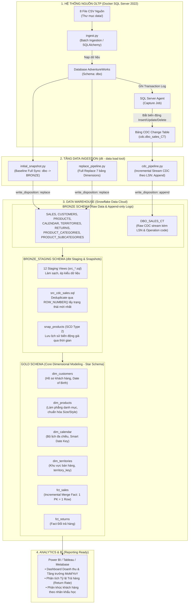
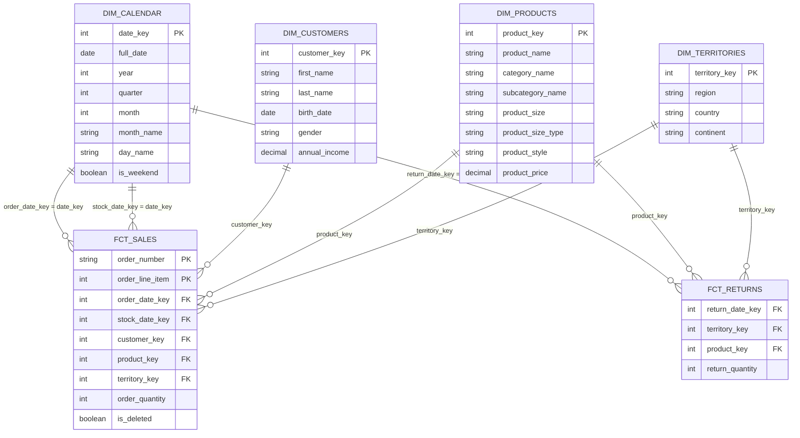

# AdventureWorks End-to-End Modern Data Platform
> **Kiến trúc Data Platform toàn diện:** Giả lập hệ thống OLTP trên SQL Server &rarr; CDC Streaming & Batch Ingestion với DLT &rarr; Snowflake Data Cloud &rarr; Data Transformation & Modeling với dbt Core (Star Schema / Medallion Architecture).

---

## 1. Kiến trúc luồng dữ liệu tổng thể (End-to-End Pipeline)



---

## 2. Cấu trúc thư mục dự án (Clean Architecture)

```
adventure_works/
├── data/                            # 8 file CSV nguồn
│   ├── calendar.csv                 # Lịch ngày tháng (911 dòng)
│   ├── customers.csv                # Khách hàng (18,148 dòng)
│   ├── product_categories.csv       # Nhóm sản phẩm (4 dòng)
│   ├── product_subcategories.csv    # Phân loại sản phẩm (37 dòng)
│   ├── products.csv                 # Sản phẩm (293 dòng)
│   ├── returns.csv                  # Dữ liệu trả hàng (1,809 dòng)
│   ├── sales.csv                    # Đơn hàng lịch sử (23,935 dòng)
│   └── territories.csv              # Khu vực bán hàng (10 dòng)
├── docker/                          # Hạ tầng Docker
│   ├── Dockerfile                   # Image SQL Server 2022 + Python runtime
│   └── entrypoint.sh                # Script khởi động SQL Server và nạp data tự động
├── scripts/
│   └── run_sqlserver.sh             # Script 1-click tự động dựng container và nạp data
├── src/                             # Mã nguồn Python Ingestion & CDC
│   ├── ingest.py                    # Nạp 8 file CSV vào SQL Server
│   ├── enable_cdc.py                # Bật SQL Server CDC trên database & bảng sales
│   └── ingests/                     # Các pipeline nạp dữ liệu DLT
│       ├── initial_snapshot.py      # Baseline sync ban đầu 8 bảng vào Snowflake Bronze
│       ├── replace_pipeline.py      # Full replace sync cho các bảng ít biến động
│       ├── cdc_pipeline.py          # Incremental sync bắt CDC log theo LSN vào Bronze
│       ├── test_conn.py             # Kiểm tra kết nối Snowflake
│       └── test_conn_sqlserver.py   # Kiểm tra kết nối SQL Server
├── dbt_project/                     # Dự án dbt Core (Transform & Modeling)
│   ├── dbt_project.yml              # Cấu hình dự án & schema chỉ định
│   ├── profiles.yml                 # Cấu hình kết nối Snowflake (RSA Key-Pair)
│   ├── macros/
│   │   └── generate_schema_name.sql # Macro ghi đè tên schema chuẩn xác
│   ├── models/
│   │   ├── sources.yml              # Khai báo các bảng nguồn từ Snowflake BRONZE
│   │   ├── schema.yml               # 30 bài kiểm thử Data Tests & tài liệu cột
│   │   ├── src/                     # [TẦNG STAGING - BRONZE_STAGING]
│   │   │   ├── src_calendar.sql
│   │   │   ├── src_customers.sql
│   │   │   ├── src_product_categories.sql
│   │   │   ├── src_product_subcategories.sql
│   │   │   ├── src_products.sql
│   │   │   ├── src_returns.sql
│   │   │   ├── src_sales.sql        # Baseline staging cho sales
│   │   │   ├── src_cdc_sales.sql    # Deduplicate CDC stream theo LSN
│   │   │   ├── src_territories.sql
│   │   │   ├── src__dlt_loads.sql
│   │   │   ├── src__dlt_pipeline_state.sql
│   │   │   └── src__dlt_version.sql
│   │   ├── dim/                     # [TẦNG GOLD - DIMENSIONS]
│   │   │   ├── dim_calendar.sql     # Bộ lịch đa chiều (Date Key, Năm, Quý, Tháng, Thứ)
│   │   │   ├── dim_customers.sql    # Khách hàng (Date of Birth, chuẩn hóa kiểu)
│   │   │   ├── dim_products.sql     # Làm phẳng danh mục, chuẩn hóa Size & Style
│   │   │   └── dim_territories.sql  # Khu vực địa lý bán hàng
│   │   └── fct/                     # [TẦNG GOLD - FACTS]
│   │       ├── fct_sales.sql        # Incremental Merge Fact (kết hợp baseline + CDC)
│   │       └── fct_returns.sql      # Fact giao dịch trả hàng
│   └── snapshots/
│       └── snap_products.sql        # SCD Type 2 theo dõi biến động giá sản phẩm
├── set_up_sql/
│   └── create_role_ingest.sql       # Script khởi tạo Role/User/Database trên Snowflake
├── .dlt/                            # Cấu hình DLT
│   ├── config.toml
│   └── secrets.toml                 # Thông tin đăng nhập bảo mật DLT
├── docker-compose.yml
├── requirements.txt
├── rsa_key.p8                       # Private key kết nối Snowflake (Key-Pair Auth)
├── rsa_key.pub                      # Public key gán cho Snowflake user
└── .env                             # Biến môi trường local
```

---

## 3. Giai đoạn 1: Giả lập hệ thống OLTP (SQL Server 2022 trên Docker)

Hệ thống sử dụng Docker để chạy container **SQL Server 2022**, đóng vai trò là cơ sở dữ liệu giao dịch (OLTP / ERP) của doanh nghiệp:

### 3.1. Danh sách Dataset và ánh xạ bảng nguồn (`src/ingest.py`)

| File nguồn (`data/`) | Bảng đích SQL Server | Số dòng | Cột kiểu ngày (`DATETIME`) | Ý nghĩa nghiệp vụ |
| :--- | :--- | :---: | :--- | :--- |
| `calendar.csv` | `dbo.calendar` | 911 | `date` | Danh mục ngày tháng phục vụ phân tích |
| `customers.csv` | `dbo.customers` | 18,148 | `birth_date` | Hồ sơ khách hàng |
| `product_categories.csv` | `dbo.product_categories` | 4 | - | Nhóm sản phẩm cấp cao nhất |
| `product_subcategories.csv` | `dbo.product_subcategories` | 37 | - | Phân loại sản phẩm chi tiết |
| `products.csv` | `dbo.products` | 293 | - | Danh mục chi tiết sản phẩm và giá bán |
| `returns.csv` | `dbo.returns` | 1,809 | `return_date` | Sự kiện khách trả lại hàng |
| `sales.csv` | `dbo.sales` | 23,935 | `order_date`, `stock_date` | Giao dịch đơn hàng bán |
| `territories.csv` | `dbo.territories` | 10 | - | Khu vực địa lý thị trường |

### 3.2. Cơ chế nạp dữ liệu:
1. `wait_for_sql_server`: Thăm dò kết nối tới cổng `1433` cho đến khi SQL Server sẵn sàng nhận lệnh.
2. `ensure_database`: Tự động khởi tạo database `AdventureWorks`.
3. Chuẩn hóa tên cột chữ thường (`lowercase`), tự động nhận diện các cột ngày tháng để ép kiểu `DATETIME`.
4. Nạp dữ liệu theo khối (`chunksize=1000`) tối ưu hóa RAM và I/O.

---

## 4. Giai đoạn 2: Kích hoạt Change Data Capture (CDC)

Dự án áp dụng công nghệ **Change Data Capture (CDC)** trên bảng giao dịch tần suất cao `sales`:

### 4.1. Kích hoạt CDC (`src/enable_cdc.py`)
1. **Bật CDC cấp Database:** Thực thi `sys.sp_cdc_enable_db`.
2. **Tạo Primary Key:** Thiết lập khóa chính tổng hợp `PK_sales` trên 2 cột `(order_number, order_line_item)`.
3. **Bật CDC cấp Table:** Thực thi `sys.sp_cdc_enable_table` trên bảng `dbo.sales`.
4. **Bảng Change Table tương ứng:** SQL Server tự động tạo bảng ghi log thay đổi: **`cdc.dbo_sales_CT`**.

### 4.2. Ý nghĩa các mã thao tác CDC (`__$operation`):
* **`1` = DELETE**: Bản ghi bị xóa khỏi hệ thống nguồn.
* **`2` = INSERT**: Đơn hàng mới được thêm vào.
* **`3` = UPDATE (Before)**: Giá trị cũ của đơn hàng *ngay trước* khi bị sửa.
* **`4` = UPDATE (After)**: Giá trị mới của đơn hàng *ngay sau* khi sửa xong.

> [!NOTE]
> Tính năng CDC phụ thuộc vào dịch vụ **SQL Server Agent**. Trong `docker-compose.yml`, biến môi trường `MSSQL_AGENT_ENABLED: "true"` luôn được bật để Agent tự động quét transaction log đưa vào bảng `cdc.dbo_sales_CT`.

---

## 5. Giai đoạn 3: Nạp dữ liệu sang Snowflake với DLT (Data Load Tool)

Sử dụng thư viện mã nguồn mở hiện đại **`dlt`** kết hợp cơ chế xác thực **RSA Key-Pair Authentication** an toàn:

### 5.1. Ba Pipeline Ingestion chuyên biệt:

#### 1. Pipeline Khởi tạo Baseline (`src/ingests/initial_snapshot.py`):
- Nạp toàn bộ 8 bảng từ `dbo` sang schema `BRONZE` trên Snowflake với chế độ `write_disposition="replace"`.
- Ghi nhận lại điểm chốt LSN lớn nhất hiện tại (`capture_checkpoint_lsn()`) làm mốc bắt đầu cho CDC.

#### 2. Pipeline Full Replace (`src/ingests/replace_pipeline.py`):
- Chuyên phụ trách 7 bảng Dimension / Returns ít biến động (`calendar`, `customers`, `products`, `product_categories`, `product_subcategories`, `returns`, `territories`).
- Chạy định kỳ với `write_disposition="replace"` để đồng bộ trạng thái mới nhất từ OLTP.

#### 3. Pipeline Streaming CDC (`src/ingests/cdc_pipeline.py`):
- Chỉ bắt bảng `cdc.dbo_sales_CT`.
- Áp dụng cơ chế con trỏ gia tăng (**Incremental Cursor**) trên trường `__$start_lsn`:
  ```python
  source.resources["dbo_sales_CT"].apply_hints(
      incremental=dlt.sources.incremental(
          '"__$start_lsn"',
          initial_value=b"\x00" * 10
      )
  )
  ```
- Đẩy dữ liệu vào bảng **`ADVENTUREWORKS.BRONZE.DBO_SALES_CT`** ở chế độ **`write_disposition="append"`** để lưu toàn bộ vết lịch sử giao dịch.

---

## 6. Giai đoạn 4: Data Modeling & Transformation với dbt Core

Dự án áp dụng kiến trúc **Medallion Architecture (Bronze &rarr; Staging &rarr; Gold)** và mô hình hình sao **Kimball Star Schema**:

### 6.1. Tầng Staging (`BRONZE_STAGING`):
Gồm 12 models view (`src_*.sql`) chịu trách nhiệm làm sạch và chuẩn hóa kiểu dữ liệu.

* **Xử lý Deduplicate CDC đặc thù trong [`src_cdc_sales.sql`](dbt_project/models/src/src_cdc_sales.sql):**
  Lọc bỏ dòng `UPDATE_BEFORE` (mã `3`), chỉ lấy sự kiện sau cùng của mỗi đơn hàng bằng hàm cửa sổ:
  ```sql
  ROW_NUMBER() OVER (
      PARTITION BY order_number, order_line_item 
      ORDER BY _start_lsn DESC, _seqval DESC
  ) AS rn
  ```

### 6.2. Tầng SCD Type 2 Snapshot ([`snapshots/snap_products.sql`](dbt_project/snapshots/snap_products.sql)):
Áp dụng chiến lược `check` trên các cột giá (`product_price`, `product_cost`) để lưu vết lịch sử biến động giá của sản phẩm theo thời gian (`dbt_valid_from`, `dbt_valid_to`).

### 6.3. Tầng Core Data Warehouse (`GOLD` - Star Schema):



#### Chi tiết các bảng tầng Gold:
1. **`dim_calendar`**: Sinh bộ lịch thời gian hoàn chỉnh từ 2020 &rarr; 2022. Tự sinh **Smart Date Key** (`YYYYMMDD` dạng INT) giúp Fact bảng không cần tốn chi phí JOIN khi tra cứu thời gian.
2. **`dim_customers`**: Chuẩn hóa thông tin nhân khẩu học của 18,148 khách hàng, ép kiểu `birth_date` sang `DATE`.
3. **`dim_products`**: Làm phẳng 3 bảng (Products + Subcategories + Categories), chuẩn hóa size hỗn hợp số/chữ (`product_size_type`: `Clothing` vs `Frame (cm)`) và phong cách (`product_style`: `Unisex`, `Women`, `Men`).
4. **`dim_territories`**: Danh mục 10 khu vực kinh doanh toàn cầu, chuẩn hóa khóa thành `territory_key`.
5. **`fct_sales`**: Bảng Fact bán hàng triển khai cơ chế **Incremental Merge**. Lần đầu tiên nạp 23,935 đơn lịch sử; các lần sau tự động MERGE các bản ghi CDC mới dựa trên cặp khóa chính `(order_number, order_line_item)`.
6. **`fct_returns`**: Bảng Fact trả hàng ghi nhận 1,809 sự kiện hoàn trả, hỗ trợ đo lường Return Rate.

---

## 7. Giai đoạn 5: Kiểm thử chất lượng dữ liệu (Data Quality Testing)

File [`models/schema.yml`](dbt_project/models/schema.yml) định nghĩa **30 bài kiểm thử tự động**:
- **Primary Key Uniqueness & Not-null:** Đảm bảo toàn bộ khóa chính trong các bảng Dim và Fact không bị trùng lặp hay mang giá trị NULL.
- **Foreign Key Referencing (`relationships`):** Đảm bảo `fct_sales.customer_key` tồn tại 100% trong `dim_customers`.
- **Accepted Values:** Kiểm tra giới tính khách hàng (`gender IN ['M', 'F']`), mã thao tác CDC (`_operation IN [1, 2, 3, 4]`).

---

## 8. Hướng dẫn vận hành hệ thống (Runbook từ A đến Z)

### Bước 1: Khởi động môi trường SQL Server trên Docker
```bash
# Cấp quyền thực thi và chạy script tự động dựng container
chmod +x scripts/run_sqlserver.sh
./scripts/run_sqlserver.sh
```

### Bước 2: Kích hoạt Change Data Capture (CDC)
```bash
.venv/bin/python src/enable_cdc.py
```

### Bước 3: Nạp dữ liệu sang Snowflake với DLT
```bash
# 1. Nạp snapshot ban đầu (Chạy lần đầu tiên)
.venv/bin/python src/ingests/initial_snapshot.py

# 2. Nạp thay thế các bảng Dimensions
.venv/bin/python src/ingests/replace_pipeline.py

# 3. Chạy sync CDC log định kỳ (hoặc sau mỗi lần có giao dịch mới)
.venv/bin/python src/ingests/cdc_pipeline.py
```

### Bước 4: Chạy Transform và Kiểm thử với dbt
```bash
cd dbt_project

# Chạy snapshot SCD Type 2 cho sản phẩm
dbt snapshot

# Khởi tạo toàn bộ mô hình (chạy full refresh lần đầu cho Fact Sales)
dbt run --select fct_sales --full-refresh
dbt run

# Chạy kiểm thử chất lượng dữ liệu (30 tests)
dbt test

# Xem thử dữ liệu trực tiếp trên terminal mà không cần mở Snowflake Web UI
dbt show --select dim_customers --limit 5
dbt show --select fct_sales --limit 5

# Sinh tài liệu và sơ đồ Data Lineage trực quan trên trình duyệt
dbt docs generate
dbt docs serve
```

---

## 9. Kịch bản kiểm chứng tính năng CDC (Verification Scenario)

Để kiểm chứng toàn bộ luồng CDC hoạt động chính xác từ OLTP sang Snowflake:

1. **Insert 1 đơn hàng mới vào SQL Server:**
   ```sql
   INSERT INTO dbo.sales (order_date, stock_date, order_number, product_key, customer_key, territory_key, order_line_item, order_quantity)
   VALUES (GETDATE(), GETDATE(), 'ORD-CDC-DEMO-999', 310, 11000, 1, 1, 10);
   ```

2. **Chạy pipeline CDC của DLT:**
   ```bash
   .venv/bin/python src/ingests/cdc_pipeline.py
   ```
   *DLT sẽ bắt bản ghi với `_OPERATION = 2` và tải 1 load package vào `ADVENTUREWORKS.BRONZE.DBO_SALES_CT`.*

3. **Chạy dbt incremental merge:**
   ```bash
   cd dbt_project && dbt run --select fct_sales
   ```
   *dbt tự động thực hiện lệnh MERGE INTO: cập nhật bảng `GOLD.FCT_SALES` với chính xác 1 dòng mới mà không cần nạp lại 23,935 dòng cũ!*
