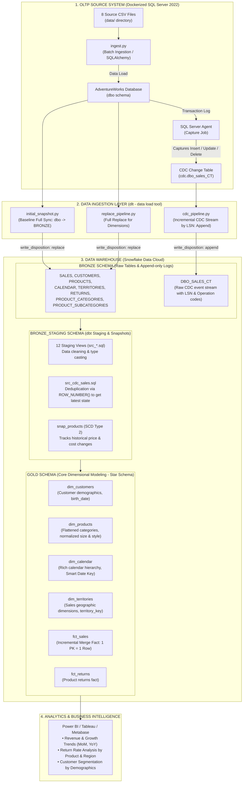
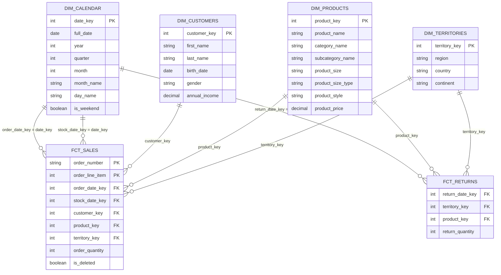

# AdventureWorks End-to-End Modern Data Platform
> **Enterprise Data Platform:** Simulated OLTP on SQL Server &rarr; CDC Streaming & Batch Ingestion with DLT &rarr; Snowflake Data Cloud &rarr; Data Transformation & Modeling with dbt Core (Star Schema / Medallion Architecture).

---

## 1. End-to-End Architecture Overview



---

## 2. Project Directory Structure

```
adventure_works/
├── data/                            # 8 Source CSV files
│   ├── calendar.csv                 # Calendar dates (911 rows)
│   ├── customers.csv                # Customer profiles (18,148 rows)
│   ├── product_categories.csv       # High-level product categories (4 rows)
│   ├── product_subcategories.csv    # Detailed product subcategories (37 rows)
│   ├── products.csv                 # Product catalog & pricing (293 rows)
│   ├── returns.csv                  # Return transactions (1,809 rows)
│   ├── sales.csv                    # Historical sales orders (23,935 rows)
│   └── territories.csv              # Geographic sales territories (10 rows)
├── docker/                          # Docker infrastructure
│   ├── Dockerfile                   # Custom SQL Server 2022 image with Python runtime
│   └── entrypoint.sh                # Container startup and automated ingestion script
├── scripts/
│   └── run_sqlserver.sh             # 1-click script to build and launch SQL Server container
├── src/                             # Ingestion & CDC Python source code
│   ├── ingest.py                    # Ingests 8 CSVs into SQL Server database
│   ├── enable_cdc.py                # Enables SQL Server CDC on database & sales table
│   └── ingests/                     # dlt (data load tool) pipelines
│       ├── initial_snapshot.py      # Full baseline ingestion of 8 tables into Snowflake Bronze
│       ├── replace_pipeline.py      # Periodic full replace sync for dimension tables
│       ├── cdc_pipeline.py          # Incremental CDC stream sync by LSN into Bronze
│       ├── test_conn.py             # Snowflake connection health check
│       └── test_conn_sqlserver.py   # SQL Server connection health check
├── dbt_project/                     # dbt Core project (Transformation & Modeling)
│   ├── dbt_project.yml              # Project configuration & schema definitions
│   ├── profiles.yml                 # Snowflake connection config (RSA Key-Pair Auth)
│   ├── macros/
│   │   └── generate_schema_name.sql # Custom schema name resolution macro
│   ├── models/
│   │   ├── sources.yml              # Declaration of Snowflake BRONZE source tables
│   │   ├── schema.yml               # 30 automated data tests & column documentation
│   │   ├── src/                     # [STAGING LAYER - BRONZE_STAGING SCHEMA]
│   │   │   ├── src_calendar.sql
│   │   │   ├── src_customers.sql
│   │   │   ├── src_product_categories.sql
│   │   │   ├── src_product_subcategories.sql
│   │   │   ├── src_products.sql
│   │   │   ├── src_returns.sql
│   │   │   ├── src_sales.sql        # Baseline staging for historical sales
│   │   │   ├── src_cdc_sales.sql    # CDC log deduplication by LSN
│   │   │   ├── src_territories.sql
│   │   │   ├── src__dlt_loads.sql
│   │   │   ├── src__dlt_pipeline_state.sql
│   │   │   └── src__dlt_version.sql
│   │   ├── dim/                     # [GOLD LAYER - DIMENSIONS]
│   │   │   ├── dim_calendar.sql     # Rich date dimension (Date Key, Year, Quarter, Month, Weekday)
│   │   │   ├── dim_customers.sql    # Cleaned customer profiles, birth_date
│   │   │   ├── dim_products.sql     # Flattened product catalog, normalized size & style
│   │   │   └── dim_territories.sql  # Geographic sales territory dimension
│   │   └── fct/                     # [GOLD LAYER - FACTS]
│   │       ├── fct_sales.sql        # Incremental Merge Fact (combining baseline + CDC events)
│   │       └── fct_returns.sql      # Product returns fact table
│   └── snapshots/
│       └── snap_products.sql        # SCD Type 2 snapshot tracking price & cost history
├── set_up_sql/
│   └── create_role_ingest.sql       # Snowflake setup script (Roles, Users, Privileges)
├── .dlt/                            # dlt framework configuration
│   ├── config.toml
│   └── secrets.toml                 # Encrypted credentials for Snowflake & SQL Server
├── docker-compose.yml
├── requirements.txt
├── rsa_key.p8                       # Snowflake private key (Key-Pair Authentication)
├── rsa_key.pub                      # Snowflake public key
└── .env                             # Local environment variables
```

---

## 3. Phase 1: OLTP System Simulation (SQL Server 2022 on Docker)

The project simulates an enterprise transactional database (OLTP / ERP) using **SQL Server 2022** running inside Docker:

### 3.1. Source Datasets & Table Mappings (`src/ingest.py`)

| Source CSV (`data/`) | Target SQL Server Table | Record Count | Date Columns (`DATETIME`) | Business Description |
| :--- | :--- | :---: | :--- | :--- |
| `calendar.csv` | `dbo.calendar` | 911 | `date` | Reference calendar dates |
| `customers.csv` | `dbo.customers` | 18,148 | `birth_date` | Customer demographic records |
| `product_categories.csv` | `dbo.product_categories` | 4 | - | Top-level product category classifications |
| `product_subcategories.csv` | `dbo.product_subcategories` | 37 | - | Granular product subcategories |
| `products.csv` | `dbo.products` | 293 | - | Complete product catalog and pricing |
| `returns.csv` | `dbo.returns` | 1,809 | `return_date` | Product return transactions |
| `sales.csv` | `dbo.sales` | 23,935 | `order_date`, `stock_date` | Historical order line-item transactions |
| `territories.csv` | `dbo.territories` | 10 | - | Geographic sales regions & countries |

### 3.2. Automated Ingestion Highlights:
1. `wait_for_sql_server`: Actively polls port `1433` until SQL Server is healthy and ready to accept queries.
2. `ensure_database`: Automatically executes `CREATE DATABASE [AdventureWorks]` if it does not already exist.
3. Standardizes column names to lowercase and strips leading/trailing whitespaces.
4. Auto-detects and casts date strings to native `DATETIME` types so SQL Server creates proper date columns instead of generic `VARCHAR`.
5. Ingests records in batches (`chunksize=1000`) for optimal memory and disk I/O performance.

---

## 4. Phase 2: Change Data Capture (CDC) Configuration

The platform leverages **SQL Server Change Data Capture (CDC)** on the high-frequency transactional table `sales`:

### 4.1. Enabling CDC (`src/enable_cdc.py`)
1. **Database-Level Enablement:** Executes `sys.sp_cdc_enable_db`.
2. **Primary Key Enforcement:** Ensures a composite primary key `PK_sales` on `(order_number, order_line_item)`.
3. **Table-Level Enablement:** Executes `sys.sp_cdc_enable_table` on `dbo.sales` with `@supports_net_changes = 1`.
4. **Change Table Generation:** SQL Server automatically creates the tracking table **`cdc.dbo_sales_CT`**.

### 4.2. CDC Operation Identifiers (`__$operation`):
* **`1` = DELETE**: Record was deleted in the OLTP database.
* **`2` = INSERT**: A new sales order was created.
* **`3` = UPDATE (Before)**: The old state of the record *immediately prior* to the update.
* **`4` = UPDATE (After)**: The updated state of the record *immediately after* the update.

> [!IMPORTANT]
> SQL Server CDC relies on the **SQL Server Agent** background capture job. In `docker-compose.yml`, `MSSQL_AGENT_ENABLED: "true"` is configured to ensure the capture job continuously writes transaction log changes into `cdc.dbo_sales_CT`.

---

## 5. Phase 3: Data Ingestion to Snowflake via DLT

The ingestion layer uses **`dlt` (data load tool)** with **RSA Key-Pair Authentication** to extract and load data into Snowflake:

### 5.1. Three Specialized Ingestion Pipelines:

#### 1. Baseline Snapshot Pipeline (`src/ingests/initial_snapshot.py`):
- Loads all 8 source tables from `dbo` to Snowflake schema `BRONZE` using `write_disposition="replace"`.
- Records the highest current Log Sequence Number (`capture_checkpoint_lsn()`) as the initial CDC checkpoint.

#### 2. Full Replace Pipeline (`src/ingests/replace_pipeline.py`):
- Dedicated to the 7 dimension and returns tables (`calendar`, `customers`, `products`, `product_categories`, `product_subcategories`, `returns`, `territories`).
- Runs on a periodic schedule with `write_disposition="replace"` to maintain synchronicity with source master data.

#### 3. Incremental CDC Streaming Pipeline (`src/ingests/cdc_pipeline.py`):
- Targets the change table `cdc.dbo_sales_CT`.
- Employs an **Incremental Cursor** on `__$start_lsn`:
  ```python
  source.resources["dbo_sales_CT"].apply_hints(
      incremental=dlt.sources.incremental(
          '"__$start_lsn"',
          initial_value=b"\x00" * 10
      )
  )
  ```
- Appends newly captured transaction events into **`ADVENTUREWORKS.BRONZE.DBO_SALES_CT`** using **`write_disposition="append"`** to preserve a complete audit trail.

---

## 6. Phase 4: Data Modeling & Transformation with dbt Core

The transformation layer adopts the **Medallion Architecture (Bronze &rarr; Staging &rarr; Gold)** and **Kimball Star Schema**:

### 6.1. Staging Layer (`BRONZE_STAGING` Schema):
Consists of 12 views (`src_*.sql`) providing preliminary cleaning, casting, and renaming.

* **CDC Deduplication Algorithm in [`src_cdc_sales.sql`](dbt_project/models/src/src_cdc_sales.sql):**
  Discards obsolete `UPDATE_BEFORE` records (`_operation = 3`) and isolates the latest event per order line using window functions:
  ```sql
  ROW_NUMBER() OVER (
      PARTITION BY order_number, order_line_item 
      ORDER BY _start_lsn DESC, _seqval DESC
  ) AS rn
  ```

### 6.2. SCD Type 2 Snapshot ([`snapshots/snap_products.sql`](dbt_project/snapshots/snap_products.sql)):
Applies dbt snapshot `check` strategy on pricing columns (`product_price`, `product_cost`) to capture price change history over time (`dbt_valid_from`, `dbt_valid_to`).

### 6.3. Gold Layer: Kimball Star Schema



#### Gold Dimension & Fact Details:
1. **`dim_calendar`**: Rich time dimension table generated from 2020 through 2022. Produces integer **Smart Date Keys** (`YYYYMMDD`), allowing Fact tables to link to time attributes without expensive SQL joins.
2. **`dim_customers`**: Demographic profiles for 18,148 customers with normalized `birth_date` cast to `DATE`.
3. **`dim_products`**: Denormalized (flattened) catalog joining products, subcategories, and categories. Standardizes mixed alphanumeric sizes (`Clothing` vs. `Frame (cm)`) and style codes (`Unisex`, `Women`, `Men`).
4. **`dim_territories`**: 10 global sales regions with unified `territory_key`.
5. **`fct_sales`**: Transactional sales fact table utilizing **Incremental Merge Strategy**. Initial run ingests 23,935 baseline orders; subsequent runs execute a `MERGE INTO` statement on `(order_number, order_line_item)` using CDC events, preventing revenue duplication.
6. **`fct_returns`**: Product returns fact table tracking 1,809 return records to measure Return Rates.

---

## 7. Phase 5: Data Quality Testing & Governance

Configured in [`models/schema.yml`](dbt_project/models/schema.yml) with **30 automated data tests**:
- **Uniqueness & Not-Null:** Enforced across all primary keys in both Dimension and Fact models.
- **Referential Integrity (`relationships`):** Verifies that `fct_sales.customer_key` exists in `dim_customers`.
- **Accepted Values:** Validates categorical domain values, such as customer gender (`gender IN ['M', 'F']`) and CDC operation codes (`_operation IN [1, 2, 3, 4]`).

---

## 8. Operational Runbook (Step-by-Step CLI Execution)

### Step 1: Start SQL Server on Docker
```bash
# Grant execution permissions and run automated startup script
chmod +x scripts/run_sqlserver.sh
./scripts/run_sqlserver.sh
```

### Step 2: Enable Change Data Capture (CDC)
```bash
.venv/bin/python src/enable_cdc.py
```

### Step 3: Execute Ingestion to Snowflake via DLT
```bash
# 1. Ingest initial baseline snapshot (run once)
.venv/bin/python src/ingests/initial_snapshot.py

# 2. Ingest master dimension tables (full replace)
.venv/bin/python src/ingests/replace_pipeline.py

# 3. Stream CDC transaction logs (run periodically or upon new events)
.venv/bin/python src/ingests/cdc_pipeline.py
```

### Step 4: Run Transformations & Tests with dbt
```bash
cd dbt_project

# 1. Execute SCD Type 2 snapshot for products
dbt snapshot

# 2. Build the entire model pipeline (use --full-refresh on the first fct_sales run)
dbt run --select fct_sales --full-refresh
dbt run

# 3. Execute all 30 automated data quality tests
dbt test

# 4. Preview model outputs directly in terminal without opening Snowflake UI
dbt show --select dim_customers --limit 5
dbt show --select fct_sales --limit 5

# 5. Generate and serve interactive documentation & lineage graph
dbt docs generate
dbt docs serve
```

---

## 9. CDC Verification Walkthrough

To verify end-to-end CDC replication and incremental merging:

1. **Insert a new sales order into SQL Server:**
   ```sql
   INSERT INTO dbo.sales (order_date, stock_date, order_number, product_key, customer_key, territory_key, order_line_item, order_quantity)
   VALUES (GETDATE(), GETDATE(), 'ORD-CDC-DEMO-999', 310, 11000, 1, 1, 10);
   ```

2. **Run the DLT CDC pipeline:**
   ```bash
   .venv/bin/python src/ingests/cdc_pipeline.py
   ```
   *DLT extracts the change event (`_OPERATION = 2`) and loads 1 package into `ADVENTUREWORKS.BRONZE.DBO_SALES_CT`.*

3. **Execute dbt incremental merge:**
   ```bash
   cd dbt_project && dbt run --select fct_sales
   ```
   *dbt executes an atomic `MERGE INTO`: merging exactly 1 new record into `GOLD.FCT_SALES` without reloading the 23,935 historical records!*
