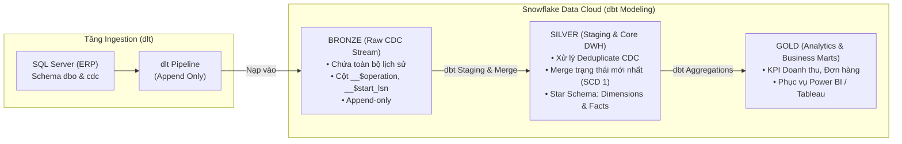

# AdventureWorks dbt Project - Data Modeling & Transformation Logic

Dự án **dbt (data build tool)** thực hiện chuẩn hóa, xử lý dữ liệu biến động (**Change Data Capture - CDC**) và xây dựng kho dữ liệu (**Data Warehouse / Medallion Architecture**) trên **Snowflake** từ dữ liệu nguồn do `dlt` nạp vào.

---

## 1. Kiến trúc luồng dữ liệu tổng thể (End-to-End Pipeline)



---

## 2. Tổ chức thư mục Models khuyến nghị (Folder Structure)

```
dbt_project/
├── models/
│   ├── staging/                       # [TẦNG STAGING] Làm sạch sơ bộ từ Bronze
│   │   ├── _sources.yml               # Khai báo các bảng nguồn từ BRONZE
│   │   ├── stg_cdc_customers.sql
│   │   ├── stg_cdc_sales.sql
│   │   ├── stg_cdc_products.sql
│   │   └── ...
│   │
│   ├── core/                          # [TẦNG SILVER] Star Schema (Dimensions & Facts)
│   │   ├── dim_customers.sql          # Trạng thái khách hàng hiện tại (SCD Type 1/Merge)
│   │   ├── dim_products.sql           # Danh mục sản phẩm hiện tại
│   │   ├── dim_territories.sql        # Khu vực bán hàng
│   │   ├── dim_calendar.sql           # Chiều thời gian
│   │   ├── fct_sales.sql              # Bảng Fact bán hàng
│   │   └── fct_returns.sql            # Bảng Fact trả hàng
│   │
│   └── marts/                         # [TẦNG GOLD] Business Aggregations & Metrics
│       ├── mart_monthly_sales.sql     # Doanh thu theo tháng & khu vực
│       └── mart_customer_rfm.sql      # Phân khúc khách hàng
│
├── snapshots/                         # [SCD TYPE 2] Lưu lịch sử biến động từng thời kỳ
│   └── snp_customers.sql
├── tests/                             # Data Quality Tests (Primary Key, Not Null...)
└── dbt_project.yml
```

---

## 3. Logic xử lý CDC trong dbt (The Core CDC Logic)

Khi dữ liệu được nạp vào tầng `BRONZE` ở chế độ **Append-only**, mỗi bảng sẽ chứa các sự kiện với mã:
- `1`: **DELETE** (Dòng bị xóa ở ERP)
- `2`: **INSERT** (Dòng thêm mới)
- `3`: **UPDATE (Before)** (Giá trị cũ trước khi sửa)
- `4`: **UPDATE (After)** (Giá trị mới sau khi sửa)

### 3.1. Thuật toán lấy trạng thái mới nhất (Deduplication Logic)
Tại tầng Staging, sử dụng hàm cửa sổ `ROW_NUMBER()` sắp xếp theo `__$start_lsn DESC, __$seqval DESC` để lấy bản ghi biến động sau cùng của từng khóa chính (`customer_key`):

```sql
-- Ví dụ: models/staging/stg_cdc_customers.sql
WITH ranked_changes AS (
    SELECT
        customer_key,
        first_name,
        last_name,
        email_address,
        annual_income,
        occupation,
        __$operation AS cdc_operation,
        __$start_lsn AS cdc_lsn,
        _dlt_load_id,
        ROW_NUMBER() OVER (
            PARTITION BY customer_key 
            ORDER BY __$start_lsn DESC, __$seqval DESC
        ) AS row_num
    FROM {{ source('bronze', 'dbo_customers_ct') }}
)
SELECT
    customer_key,
    first_name,
    last_name,
    email_address,
    annual_income,
    occupation,
    cdc_operation,
    cdc_lsn,
    CASE 
        WHEN cdc_operation = 1 THEN TRUE 
        ELSE FALSE 
    END AS is_deleted
FROM ranked_changes
WHERE row_num = 1;
```

---

### 3.2. Logic Incremental Merge lên tầng Silver (`dim_customers.sql`)

Sử dụng cơ chế `materialized='incremental'` kết hợp chiến lược `incremental_strategy='merge'` để dbt tự động sinh lệnh `MERGE INTO` trên Snowflake:

```sql
-- models/core/dim_customers.sql
{{ config(
    materialized='incremental',
    unique_key='customer_key',
    incremental_strategy='merge'
) }}

WITH latest_cdc AS (
    SELECT * FROM {{ ref('stg_cdc_customers') }}
)

SELECT
    customer_key,
    first_name,
    last_name,
    email_address,
    annual_income,
    occupation,
    is_deleted,
    CURRENT_TIMESTAMP() AS dbt_updated_at
FROM latest_cdc
-- Nếu muốn xóa hẳn các dòng bị Delete ở ERP:
-- WHERE is_deleted = FALSE


    -- Khi chạy incremental, chỉ lấy các dòng có LSN mới hơn lần chạy trước
    WHERE cdc_lsn > (SELECT MAX(cdc_lsn) FROM {{ this }})

```

---

## 4. Ánh xạ dữ liệu Star Schema (Silver Layer)

| Bảng Silver | Nguồn Bronze tương ứng | Khóa chính (Primary Key) | Loại Model |
| :--- | :--- | :--- | :--- |
| `dim_customers` | `dbo_customers_ct` / snapshot | `customer_key` | Dimension (SCD 1 / Merge) |
| `dim_products` | `dbo_products_ct` + categories | `product_key` | Dimension |
| `dim_territories` | `dbo_territories_ct` | `sales_territory_key` | Dimension |
| `dim_calendar` | `dbo_calendar_ct` | `date` | Dimension |
| `fct_sales` | `dbo_sales_ct` | `order_number`, `order_line_item` | Fact |
| `fct_returns` | `dbo_returns_ct` | `return_date`, `territory_key`, `product_key` | Fact |

---

## 5. Hướng dẫn vận hành dự án dbt

### 5.1. Kiểm tra kết nối tới Snowflake
```bash
dbt debug
```

### 5.2. Cài đặt dbt dependencies (nếu có dùng dbt-utils)
```bash
dbt deps
```

### 5.3. Chạy toàn bộ Models
```bash
# Chạy toàn bộ models
dbt run

# Hoặc chỉ chạy tầng staging
dbt run --select staging

# Hoặc chỉ chạy tầng core
dbt run --select core
```

### 5.4. Chạy kiểm thử chất lượng dữ liệu (Data Quality Tests)
```bash
dbt test
```

### 5.5. Sinh tài liệu và sơ đồ luồng dữ liệu (Lineage Graph)
```bash
dbt docs generate
dbt docs serve
```
